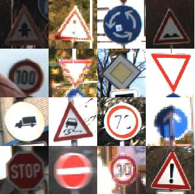
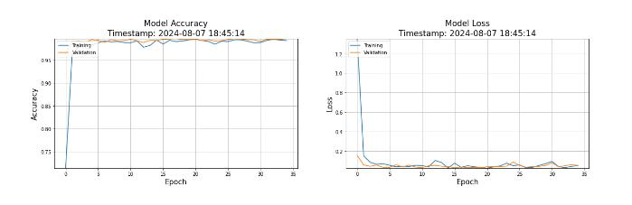

# Verified-Neural-Network-for-Traffic-Sign-Recognition
• Developed and verified a neural network for traffic sign recognition using Frama-C and ACSL. Translated the model
into C code and specified safety properties to ensure robust and correct classification of traffic signs. Tested the
model’s robustness using adversarial attacks (FGSM) and validated it through SMT solvers (Z3, Alt-Ergo). Applied
Why3 for advanced theorem proving on critical properties.
• Technologies: Python, TensorFlow, C, Frama-C, ACSL, Z3, Alt-Ergo, Why3

